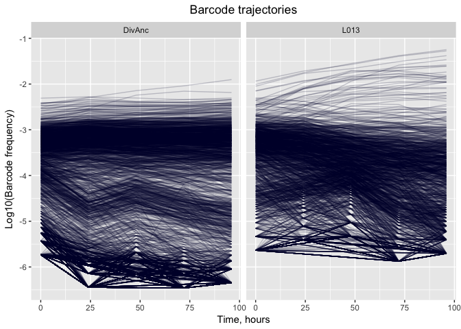
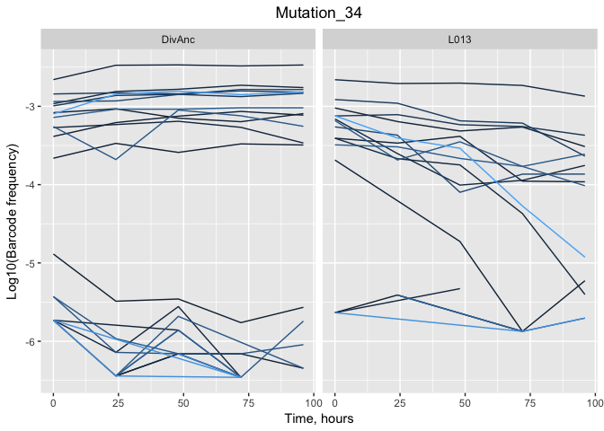
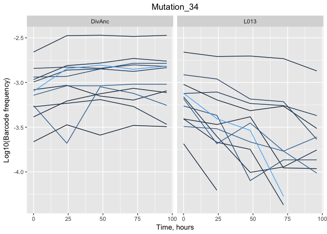
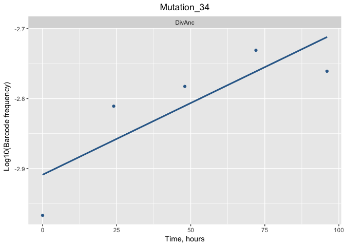

```r
#install.packages("tidyverse")
```


```r
library(tidyverse)
```

```
## ── Attaching packages ─────────────────────────────────────────── tidyverse 1.2.1 ──
```

```
## ✔ ggplot2 2.2.1     ✔ purrr   0.2.4
## ✔ tibble  1.4.2     ✔ dplyr   0.7.5
## ✔ tidyr   0.8.1     ✔ stringr 1.3.1
## ✔ readr   1.1.1     ✔ forcats 0.3.0
```

```
## ── Conflicts ────────────────────────────────────────────── tidyverse_conflicts() ──
## ✖ dplyr::filter() masks stats::filter()
## ✖ dplyr::lag()    masks stats::lag()
```


```r
exp_data <- read.csv("Experimental_results.csv")
head(exp_data)
```

```
##   X BC_ID       H_0      H_24      H_48      H_72      H_96 Mut_ID Strain
## 1 1     1 -5.430079 -6.142158        NA -6.159939        NA    185 DivAnc
## 2 2    10 -5.731109        NA        NA        NA        NA    655 DivAnc
## 3 3    16 -5.731109 -6.443188        NA -6.460969        NA    648 DivAnc
## 4 4    18        NA -6.443188        NA        NA        NA    109 DivAnc
## 5 5    23        NA        NA -6.159156        NA        NA    421 DivAnc
## 6 6    30 -3.762626 -3.634977 -3.862490 -4.093613 -4.425554   1012 DivAnc
##   Environment
## 1      SC_3.0
## 2      SC_3.0
## 3      SC_3.0
## 4      SC_3.0
## 5      SC_3.0
## 6      SC_3.0
```


```r
exp_data <- select(exp_data, -X)
head(exp_data)
```

```
##   BC_ID       H_0      H_24      H_48      H_72      H_96 Mut_ID Strain
## 1     1 -5.430079 -6.142158        NA -6.159939        NA    185 DivAnc
## 2    10 -5.731109        NA        NA        NA        NA    655 DivAnc
## 3    16 -5.731109 -6.443188        NA -6.460969        NA    648 DivAnc
## 4    18        NA -6.443188        NA        NA        NA    109 DivAnc
## 5    23        NA        NA -6.159156        NA        NA    421 DivAnc
## 6    30 -3.762626 -3.634977 -3.862490 -4.093613 -4.425554   1012 DivAnc
##   Environment
## 1      SC_3.0
## 2      SC_3.0
## 3      SC_3.0
## 4      SC_3.0
## 5      SC_3.0
## 6      SC_3.0
```

let's practice using the select function:


```r
practice <- select(exp_data, Mut_ID, Strain, Environment)
head(practice)
```

```
##   Mut_ID Strain Environment
## 1    185 DivAnc      SC_3.0
## 2    655 DivAnc      SC_3.0
## 3    648 DivAnc      SC_3.0
## 4    109 DivAnc      SC_3.0
## 5    421 DivAnc      SC_3.0
## 6   1012 DivAnc      SC_3.0
```


```r
exp_rearranged <- gather(exp_data, Generation, Frequency, H_0:H_96)
table_for_graph <- separate(exp_rearranged, Generation, into=c("H", "Time"))
table_for_graph <- select(table_for_graph, -H)
table_cleaned <- na.omit(table_for_graph)
table_cleaned$Time <- as.numeric(table_cleaned$Time)
head(table_cleaned)
```

```
##   BC_ID Mut_ID Strain Environment Time Frequency
## 1     1    185 DivAnc      SC_3.0    0 -5.430079
## 2    10    655 DivAnc      SC_3.0    0 -5.731109
## 3    16    648 DivAnc      SC_3.0    0 -5.731109
## 6    30   1012 DivAnc      SC_3.0    0 -3.762626
## 7    38    333 DivAnc      SC_3.0    0 -5.430079
## 8    45     71 DivAnc      SC_3.0    0 -3.143398
```


```r
ggplot(table_cleaned)+geom_line(aes(x=Time, y=Frequency, group=BC_ID), alpha=0.2,colour="#000033")+facet_grid(.~Strain)+ggtitle("Barcode trajectories")+theme(plot.title = element_text(hjust = 0.5))+xlab("Time, hours")+ylab("Log10(Barcode frequency)")
```

<!-- -->

could use package "plotly" that allows you to mouse over and annotate elements of the chart. It would show you which lines correspond to which strain. 


```r
mut34 <-filter(table_cleaned, table_cleaned$Mut_ID=="34")

ggplot(mut34,aes(Time, Frequency, group=BC_ID, color=BC_ID))+geom_line()+theme(legend.position="none")+facet_grid(.~Strain)+ggtitle("Mutation_34")+xlab("Time, hours") + ylab("Log10(Barcode frequency)")+theme(plot.title = element_text(hjust = 0.5))
```

<!-- -->
Disregard the bottom lines, they are just noise.


```r
mut34_f <- filter(mut34, mut34$Frequency>=log(0.01))

ggplot(mut34_f,aes(Time, Frequency, group=BC_ID, color=BC_ID))+geom_line()+theme(legend.position="none")+facet_grid(.~Strain)+ggtitle("Mutation_34")+xlab("Time, hours") + ylab("Log10(Barcode frequency)")+theme(plot.title = element_text(hjust = 0.5))
```

<!-- -->
Now lets select only strain 25361 in strain DivAnc

```r
BC_25361 <- filter(mut34_f, mut34_f$BC_ID=="25361", mut34_f$Strain=="DivAnc")

BC_25361_plot <- ggplot(BC_25361,aes(Time, Frequency, group=BC_ID, color=BC_ID))+geom_point()+theme(legend.position="none")+facet_grid(.~Strain)+geom_smooth(se=FALSE, method = "lm")+ggtitle("Mutation_34")+xlab("Time, hours") + ylab("Log10(Barcode frequency)")+theme(plot.title = element_text(hjust = 0.5))
```

Alternatively could save the ggplot code as an object and add "+geom_smooth..." etc on it. Saves typing.


```r
BC_25361_smooth <- BC_25361_plot+geom_smooth(se = FALSE, method = "lm")
BC_25361_smooth
```

<!-- -->


```r
regression_model<-lm(Frequency~Time, BC_25361)
summary_data <- summary(regression_model)
summary_data
```

```
## 
## Call:
## lm(formula = Frequency ~ Time, data = BC_25361)
## 
## Residuals:
##        1        2        3        4        5 
## -0.05810  0.04879  0.02783  0.03036 -0.04888 
## 
## Coefficients:
##               Estimate Std. Error t value Pr(>|t|)    
## (Intercept) -2.9088351  0.0443664 -65.564 7.82e-06 ***
## Time         0.0020506  0.0007547   2.717   0.0727 .  
## ---
## Signif. codes:  0 '***' 0.001 '**' 0.01 '*' 0.05 '.' 0.1 ' ' 1
## 
## Residual standard error: 0.05728 on 3 degrees of freedom
## Multiple R-squared:  0.7111,	Adjusted R-squared:  0.6147 
## F-statistic: 7.383 on 1 and 3 DF,  p-value: 0.07273
```


```r
# The information we are interested in is the value of Slopeand Intercept of this line:
# Let's try to access them:

# Time
Time<-summary_data$coefficients[2]
Time
```

```
## [1] 0.002050551
```


```r
# Intercept:
Intercept<-summary_data$coefficients[1]
Intercept
```

```
## [1] -2.908835
```


```r
# Lets create the file:
data_header=matrix(data = NA,nrow = 1,ncol = 7)
        data_header[1]="Mut_ID"
        data_header[2]="BC_ID"
        data_header[3]="Strain"
        data_header[4]="Slope"
        data_header[5]="Intercept"
        data_header[6]="R^2"
write.table(data_header,"~/Desktop/temp/bimm_143_github/Aleena_Lecture/practice_output.csv",append = FALSE, sep = ",",eol="\n",dec=".",row.names = FALSE,col.names = FALSE)
```


```r
for (mut in unique(table_cleaned$Mut_ID)) {
    mut_data=filter(table_cleaned,table_cleaned$Mut_ID==paste(mut))
    #now we have all data for each mutation separately
    for (bc in unique (mut_data$BC_ID)) {
      #now we filtered data for each barcode within 1 mutation
      bc_mut_data=filter(mut_data,mut_data$BC_ID==paste(bc))
      for (strain in unique (bc_mut_data$Strain)) {
        str_bc_mut_data=filter(bc_mut_data,bc_mut_data$Strain==paste(strain))
        #only considering combinations with 3 or more data points - anything less is statistically insignificant
        if (nrow(str_bc_mut_data)>2){
          regression_model=lm(Frequency~Time,str_bc_mut_data)
          summary_data=summary(regression_model)
          #now write to the output file! Prepare the data array first
          data_output=matrix(data = NA,nrow = 1,ncol = 6)
          data_output[1]=mut
          data_output[2]=bc
          data_output[3]=strain
          #slope
          data_output[4]=summary_data$coefficients[2]
          #intercept
          data_output[5]=summary_data$coefficients[1]
          #r-squared
          data_output[6]=summary_data$r.squared
          #time to write
          write.table(data_output,"~/Desktop/temp/bimm_143_github/Aleena_Lecture/practice_output.csv",append = TRUE, sep = ",",eol="\n",dec=".",row.names = FALSE,col.names = FALSE)
      }
    }
  }
 }
```

