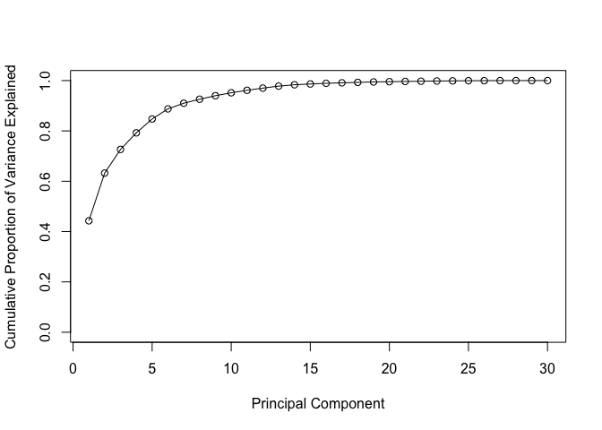

##Part A: Loading Data


```r
#Read file
wisc.df <- read.csv(file = "WisconsinCancer.csv", header = TRUE)
wisc.data <- as.matrix(wisc.df[,3:ncol(wisc.df)])
```


```r
#Check that our data matches the original when converted to 0 and 1's
diagnosis <- as.numeric(wisc.df$diagnosis == "M")
sum(diagnosis)
```

```
## [1] 212
```

Q1. How many observations are in this dataset?

```r
print(dim(wisc.df))
```

```
## [1] 569  33
```

Q2. How many variables/features in the data are suffixed with _mean?

```r
grep(("_mean"), names(wisc.df))
```

```
##  [1]  3  4  5  6  7  8  9 10 11 12
```

```r
length(grep(("_mean"), names(wisc.df)))
```

```
## [1] 10
```

Q3. How many of the observations have a malignant diagnosis?


```r
diagnosis <- as.numeric(wisc.df$diagnosis == "M")
sum(diagnosis)
```

```
## [1] 212
```

## Part B: PCA

How does the mean and variance look throughout the data? Do we need to scale it?

Means:

```r
colMeans(wisc.data)
```

```
##             radius_mean            texture_mean          perimeter_mean 
##            1.412729e+01            1.928965e+01            9.196903e+01 
##               area_mean         smoothness_mean        compactness_mean 
##            6.548891e+02            9.636028e-02            1.043410e-01 
##          concavity_mean     concave.points_mean           symmetry_mean 
##            8.879932e-02            4.891915e-02            1.811619e-01 
##  fractal_dimension_mean               radius_se              texture_se 
##            6.279761e-02            4.051721e-01            1.216853e+00 
##            perimeter_se                 area_se           smoothness_se 
##            2.866059e+00            4.033708e+01            7.040979e-03 
##          compactness_se            concavity_se       concave.points_se 
##            2.547814e-02            3.189372e-02            1.179614e-02 
##             symmetry_se    fractal_dimension_se            radius_worst 
##            2.054230e-02            3.794904e-03            1.626919e+01 
##           texture_worst         perimeter_worst              area_worst 
##            2.567722e+01            1.072612e+02            8.805831e+02 
##        smoothness_worst       compactness_worst         concavity_worst 
##            1.323686e-01            2.542650e-01            2.721885e-01 
##    concave.points_worst          symmetry_worst fractal_dimension_worst 
##            1.146062e-01            2.900756e-01            8.394582e-02 
##                       X 
##                      NA
```

Standard Deviations:

```r
apply(wisc.data, 2, sd)
```

```
##             radius_mean            texture_mean          perimeter_mean 
##            3.524049e+00            4.301036e+00            2.429898e+01 
##               area_mean         smoothness_mean        compactness_mean 
##            3.519141e+02            1.406413e-02            5.281276e-02 
##          concavity_mean     concave.points_mean           symmetry_mean 
##            7.971981e-02            3.880284e-02            2.741428e-02 
##  fractal_dimension_mean               radius_se              texture_se 
##            7.060363e-03            2.773127e-01            5.516484e-01 
##            perimeter_se                 area_se           smoothness_se 
##            2.021855e+00            4.549101e+01            3.002518e-03 
##          compactness_se            concavity_se       concave.points_se 
##            1.790818e-02            3.018606e-02            6.170285e-03 
##             symmetry_se    fractal_dimension_se            radius_worst 
##            8.266372e-03            2.646071e-03            4.833242e+00 
##           texture_worst         perimeter_worst              area_worst 
##            6.146258e+00            3.360254e+01            5.693570e+02 
##        smoothness_worst       compactness_worst         concavity_worst 
##            2.283243e-02            1.573365e-01            2.086243e-01 
##    concave.points_worst          symmetry_worst fractal_dimension_worst 
##            6.573234e-02            6.186747e-02            1.806127e-02 
##                       X 
##                      NA
```

We can see that there is an extra column "X" full of "NA" that we need to remove


```r
  #wisc.df <- wisc.df[,1:(ncol(wisc.df)-1)] OR the way Barry showed us:
  wisc.df <- wisc.df[-ncol(wisc.df)]
  wisc.data <- wisc.data[,-ncol(wisc.data)]
```

Now that we've removed that non-sense column, let's make a PCA!!

```r
# Perform PCA on wisc.data by completing the following code
wisc.pr <- prcomp(wisc.data)
```

One variable explains 98% of the data here, which is good but not what we want. We want a multivariate display. So we need to rescale it.


```r
wisc.pr <- prcomp(wisc.data, scale. = TRUE)
```

Q4. From your results, what proportion of the original variance is captured by the first principal components (PC1)?


```r
summaryPCA <- summary(wisc.pr)
summaryPCA$importance[3,1]
```

```
## [1] 0.44272
```


Q5. How many principal components (PCs) are required to describe at least 70% of the original variance in the data?


```r
print(which(summaryPCA$importance[3,] >= .70))
```

```
##  PC3  PC4  PC5  PC6  PC7  PC8  PC9 PC10 PC11 PC12 PC13 PC14 PC15 PC16 PC17 
##    3    4    5    6    7    8    9   10   11   12   13   14   15   16   17 
## PC18 PC19 PC20 PC21 PC22 PC23 PC24 PC25 PC26 PC27 PC28 PC29 PC30 
##   18   19   20   21   22   23   24   25   26   27   28   29   30
```
PCA3 is the first with a cummulative variance above 70%

Q6. How many principal components (PCs) are required to describe at least 90% of the original variance in the data?


```r
print(which(summaryPCA$importance[3,] >= .90))
```

```
##  PC7  PC8  PC9 PC10 PC11 PC12 PC13 PC14 PC15 PC16 PC17 PC18 PC19 PC20 PC21 
##    7    8    9   10   11   12   13   14   15   16   17   18   19   20   21 
## PC22 PC23 PC24 PC25 PC26 PC27 PC28 PC29 PC30 
##   22   23   24   25   26   27   28   29   30
```
We need 7 PCs before we can explain 90% of the  (scaled) data

## Interpreting PCA Results
Let's plot PC1 against PC2

```r
plot(wisc.pr$x[,c(1,2)], col = diagnosis+1, 
     xlab = "PC1", ylab = "PC2", pch = as.vector(wisc.df$diagnosis))
```

<!-- -->

Now let's plot PC1 against PC3

```r
# Repeat for components 1 and 3
plot(wisc.pr$x[, c(1, 3)], col = (diagnosis + 1), 
     xlab = "PC1", ylab = "PC3")
```

<!-- -->


```r
biplot(wisc.pr)
```

<!-- -->
#Variance Explained: Scree Plot

```r
#Calculate variance of each component
pr.var <- wisc.pr$sdev^2
#Proportion of variance
pve <- pr.var / sum(pr.var)
#Plot variance explained for each prinicpal component
plot(pve, xlab = "Principal Component", ylab = "Proportion of Variance Explained", ylim = c(0,1), type = "o")
```

<!-- -->


```r
# Alternative scree plot of the same data, note data driven y-axis
barplot(pve, ylab = "Precent of Variance Explained",
     names.arg=paste0("PC",1:length(pve)), las=2, axes = FALSE)
axis(2, at=pve, labels=round(pve,2)*100 )
```

<!-- -->


```r
# Plot cumulative proportion of variance explained
plot(cumsum(pve) , xlab = "Principal Component", 
     ylab = "Cumulative Proportion of Variance Explained", 
     ylim = c(0, 1), type = "o")
```

<!-- -->

par()

```r
#edit preferences to show 1 row 2 columns of plots
par(mfrow=c(1,2))

plot(pve, xlab = "Principal Component", ylab = "Proportion of Variance Explained", ylim = c(0,1), type = "o")

plot(cumsum(pve) , xlab = "Principal Component", 
     ylab = "Cumulative Proportion of Variance Explained", 
     ylim = c(0, 1), type = "o")
```

<!-- -->

## Heirarchical Clustering
Let's make a supervised(?) learning method 


```r
#Sclae the sic.data data: data.scaled
data.scaled <- scale(wisc.data)
#Calculate distance matrix needed for hclust
data.dist <- dist(data.scaled)
#
wisc.hclust.clusters <- hclust(data.dist)
```


```r
plot(wisc.hclust.clusters)
abline(h=20, col = 'red')
```

<!-- -->

```r
wisc.hclust.clusters <- cutree(wisc.hclust.clusters, h=20)

#or wisc.hsclus.clusters <- cutree(wisc.hclust, k=4)
```

Let's look at the clusters


```r
table(wisc.hclust.clusters)
```

```
## wisc.hclust.clusters
##   1   2   3   4 
## 177   7 383   2
```
this tells us there are 177 patients in cluster 1, 7 in cluster 2, 383 in cluster 3, and 2 in cluster 4. 


Now lets look at the groupings when cross tabulated with diagnosis

```r
table(wisc.hclust.clusters, diagnosis)
```

```
##                     diagnosis
## wisc.hclust.clusters   0   1
##                    1  12 165
##                    2   2   5
##                    3 343  40
##                    4   0   2
```

this shows us there in cluster 1, 12 patients had benign tumors while a majority of 165 patients had malignant cancers. Most of the malignant tumors are in cluster 1 and the majority of benign tumors are in cluster 3.


Maybe a different clustering would give us better results. Let's use kmeans to see what the computer thinks in the best clustering!


```r
wisc.km <- kmeans(wisc.data, centers= 2, nstart= 400)
table(wisc.km$cluster, wisc.hclust.clusters)
```

```
##    wisc.hclust.clusters
##       1   2   3   4
##   1 109   2  18   2
##   2  68   5 365   0
```

we can see that the y-axis (kmeans with 2 clusters) generally sorts the prior data so that most of the malignant patients are in kmeans$cluster1 and most of the begnign patients are in kmeans$cluster2. It's vaguely similar to our cutree, handmade clustering. 


```r
table(wisc.km$cluster, diagnosis)
```

```
##    diagnosis
##       0   1
##   1   1 130
##   2 356  82
```
wow! we have a somewhat improved method. We can mess with the nstart value to make the clustering "better"

##Section 5: Clustering on PCA results


```r
## Use the distance along the first 7 PCs for clustering i.e. wisc.pr$x[, 1:7]
dist_hclust_pr <- dist(wisc.pr$x[,1:7])
wisc.pr.hclust <- hclust(dist_hclust_pr)
plot(wisc.pr.hclust)
abline(h=20, col='red')
```

<!-- -->

```r
wisc.pr.hclust <- cutree(wisc.pr.hclust, k=9)
table(wisc.pr.hclust, diagnosis)
```

```
##               diagnosis
## wisc.pr.hclust   0   1
##              1   0  70
##              2 311  96
##              3   0   4
##              4   5  34
##              5   0   5
##              6  25   0
##              7   2   0
##              8  14   1
##              9   0   2
```

Let's plot our clusters!


```r
plot(wisc.pr$x[,c(1,2)], col = wisc.pr.hclust, 
     xlab = "PC1", ylab = "PC2", pch = as.vector(wisc.df$diagnosis))
```

<!-- -->


```r
## Use the distance along the first 7 PCs for clustering i.e. wisc.pr$x[, 1:7]
wisc.pr.hclust2 <- kmeans(wisc.pr$x, centers = 2, nstart = 200)
table(wisc.pr.hclust2$cluster, diagnosis)
```

```
##    diagnosis
##       0   1
##   1 343  37
##   2  14 175
```

Let's plot our clusters!


```r
plot(wisc.pr$x[,c(1,2)], col = wisc.pr.hclust2$cluster, 
     xlab = "PC1", ylab = "PC2", pch = as.vector(wisc.df$diagnosis))
```

<!-- -->
